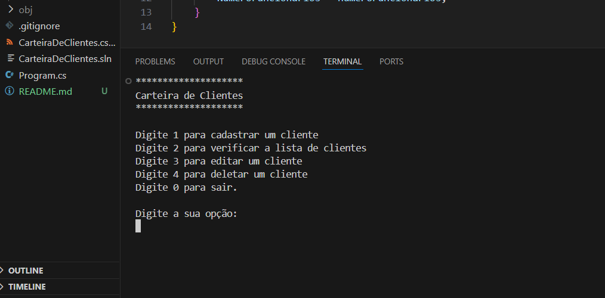

# Carteira de Clientes — Projeto em C# (v1.2)

Este projeto foi desenvolvido com o objetivo de praticar **C#**, reforçar **conceitos de Programação Orientada a Objetos (POO)** e exercitar construção de aplicações estruturadas do zero, sem seguir modelos pré‑prontos.

A aplicação permite gerenciar uma lista de clientes por meio de um **CRUD completo**, utilizando **persistência local em JSON**.





---

## 🎯 Objetivo do Projeto

Criar uma aplicação de console organizada, escalável e alinhada às boas práticas de C#, servindo como primeira entrega sólida na stack.

---

## 🚀 Funcionalidades (v1.2)

* Cadastro de clientes (nome, email, telefone, endereço)
* Edição de dados
* Remoção de clientes
* Listagem completa
* Busca por nome
* Persistência local via arquivo JSON
* Estrutura modular com métodos auxiliares e organização por pastas

---

## 🧠 Destaques Técnicos

* Uso de classes separadas por responsabilidade
* Prática de conceitos de POO (encapsulamento, abstração, instâncias, composição)
* Persistência local com serialização/deserialização JSON
* Várias refatorações ao longo do desenvolvimento para melhorar legibilidade
* Aproximadamente **1000 linhas de código** somando classes, lógica e módulos auxiliares

---

## 📈 Roadmap

### **v2.0 — API REST (C# Web API / .NET)**

* Endpoints públicos e privados
* Documentação com Swagger
* Testes básicos de integração

### **v3.0 — Front-end Web**

* Interface reactiva (React ou Razor Pages)
* Conexão com API

---

## 🖼 Prévia Visual

*(Inserir aqui um print da tela inicial do console)*

Sugestão: capturar a tela do menu principal, com as opções de CRUD, para transmitir clareza imediata da aplicação.

```
/public/images/captura-de-tela.png
```

---

## 📚 Aprendizados

* Organização de pastas e modularização foi o maior desafio
* Entendimento mais claro sobre quando criar métodos auxiliares e separar responsabilidades
* Prática real de escrita e leitura de arquivos JSON

---

## 🔗 Repositório

GitHub: [https://github.com/eritonLongui/Carteira-de-Clientes---dotnet](https://github.com/eritonLongui/Carteira-de-Clientes---dotnet)

---

## 📝 Licença

Este projeto é de uso livre para estudo e evolução da comunidade.
